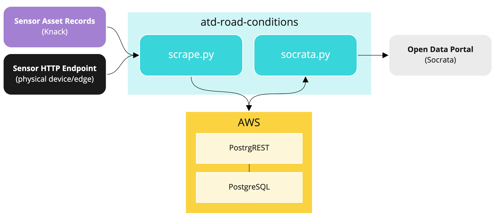

# atd-road-conditions

Processing and publication of Austin Transportation's road condition sensor data.

## About

Austin Transportation maintains a handful of road condition sensors across the city which monitor the temperature and surface condition of roadways. These sensors enable our Mobility Management Center to stay apprised of potential roadway hazards and intervene when necessary.

This repo contains Python scripts and modules which fetch data from these sensors and publish it to [a public dataset](https://data.austintexas.gov/dataset/Real-Time-Road-Conditions/ypbq-i42h/data) on the City of Austin's Open Data Portal.

## System Design



Sensor asset records are maintained in the Data Tracker, our Knack-powered asset management system.

The physical sensor devices are deployed at bridges across the city and expose an HTTP endpoint across our signal communcations network.

The data processing follows two steps:

### Data Extraction

On initializaiton, `scrape.py` downloads the sensor asset records from the Data Tracker and constructs a `Sensor` instance for each sensor, and fetches data sensor asynchronously at a 60-second interval. Data is lightly transformed and posted to a PostgreSQL database via [PostgREST](http://postgrest.com/) API.

### Data Publication

`socrata.py` retrieves data from the PostgREST API and upserts them to [this public dataset](https://data.austintexas.gov/dataset/Real-Time-Road-Conditions/ypbq-i42h/data).

This script supports a `--date` argument which expects an ISO date string that will be applied as a filter such that only records created after the given date will be retrieved and processed. If no date filter is provided, all records will be fetched and upserted.

## Deployment

These scripts are designed to be containerized within the included `Dockerfile`. Any push to the `production` branch will cause a new docker image to be built and pushed to Dockerhub with tags `production`, `latest`, and `staging`. (We tag with `staging` because our Airflow instance pulls images with the `staging` tag).

`scape.py` is deployed on our primary Linux server. A `cron` task fires `bash_scripts/manage_container.sh` every minute to make sure the scraper container exists and is running.

`socrata.py` is deployed to our [Airlfow server](https://github.com/cityofaustin/atd-airflow).

## Configuration and Development

The scripts rely on the following environmental variables, available in the DTS credential store.

- `KNACK_API_KEY`: The API key of the AMD Data Tracker
- `KNACK_APP_ID`: The APP ID of the AMD Data Tracker
- `PGREST_ENDPOINT`: The URL of our PostgREST API endpoint
- `PGREST_JWT`: The secret JSON web token of our authenticated PostGREST user
- `SOCRATA_API_KEY_ID`: The Socrata API key ID
- `SOCRATA_API_KEY_SECRET`: The Socrata API key secret
- `SOCRATA_APP_TOKEN`: The Socrata API token

Access to the sensor devices is highly restricted. `dummy_api.py` is available as a Flask app that mocks the sensor endpoint. When using the dummy API, you'll need to monkey patch your local host IP into the `Sensor` class.

When developing locally, you'll likely want to mount your local copy of the repo as well as an environment file into the container, like so:

```
$ docker run --network host -it --rm --env-file env_file -v /my/path/to/atd-road-conditions:/app atddocker/atd-road-conditions atd-road-conditions/scrape.py
```
